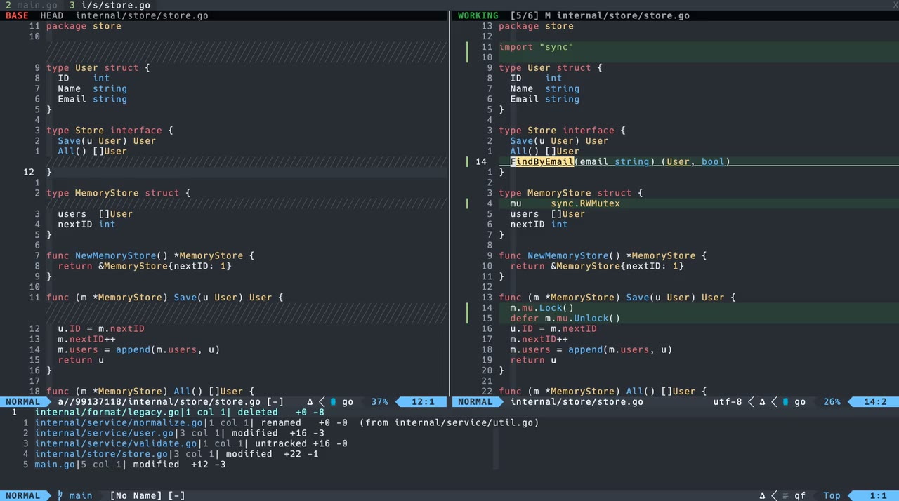

<div align="center">

# agent-review.nvim

**Review what your AI agent wrote with a side-by-side diff where LSP still works,<br>and the base side follows you wherever you jump.**

[](https://github.com/tyzerrr/agent-review.nvim/actions/workflows/test.yml)


[](LICENSE)

[](docs/demo.mp4)

<sub>▶ Click the image to watch the demo (54s, mp4)</sub>

</div>

---

## Why

Coding agents (Claude Code, Codex, Cursor, …) change many files at once. Reviewing that in a plain diff viewer
leaves out the most useful part of an editor: you can't **go to definition** or **find references** to check
how the new code fits into the rest of the codebase. If you open the file normally to navigate, you lose the diff.

`agent-review.nvim` keeps both:

```
┌─ BASE  HEAD  store.go ──────────────┬─ WORKING  [5/6] M store.go ──────────┐
│ type Store interface {              │ type Store interface {               │
│   Save(u User) User                 │   Save(u User) User                  │
│   All() []User                      │   All() []User                       │
│ ╱╱╱╱╱╱╱╱╱╱╱╱╱╱╱╱╱╱╱╱╱╱╱╱╱╱╱╱╱╱╱╱╱╱╱ │   FindByEmail(email string) …  ◀ gd  │
│ }                                   │ }                                    │
│   read-only, at the base revision   │   your real buffer: LSP, edit, save  │
└─────────────────────────────────────┴──────────────────────────────────────┘
  quickfix: changed files / hunks                     Claude Code terminal →
```

- **Right**: the real working-tree buffer. Your language server, keymaps and edits all work as usual.
- **Left**: the same file at the base revision (`HEAD` by default), read-only, with syntax highlighting.
- **Left follows right**: when you `gd`, `gr`, `<C-o>`, `:e`, `:cnext` or pick a Telescope entry on the right,
  the left side switches to that file at the base revision, and the cursor positions stay aligned.

## Features

- 🧭 **LSP-aware navigation**: go to definition, references and implementations across files, and the diff follows
- 🎨 **VSCode-style colors**: removed lines are red and added lines are green, with stronger color on the changed characters (`inline:char`, `linematch`)
- 🌳 **Syntax highlighting on both sides**: tree-sitter on the base side too, with no LSP diagnostics there
- 📋 **Quickfix integration**: every changed file (or every hunk) goes into a quickfix list, so `]q` walks the whole review and wraps around at either end
- 🔄 **Auto refresh**: when the agent edits, creates or reverts files, the file list, quickfix, buffers and diff update by themselves, so you don't need to reopen the review
- 🔭 **Telescope pickers**: changed files and changed hunks, with a syntax-highlighted inline diff preview
- 🧹 **Handles every git status**: modified, added, untracked, deleted, renamed (diffed against the old path), gitignored and outside-repo files
- 🤖 **Claude Code integration** ([claudecode.nvim](https://github.com/coder/claudecode.nvim)):
  - Select base-side lines and press `<C-l>` to send them to Claude
  - The Claude terminal moves into the review tab, and the windows re-balance when it opens, closes or resizes
- 🛡️ **Safe**: it never writes to your working tree; base snapshots live under `.git/agent-review/`. Closing the review keeps your other windows (the Claude terminal, help, other files) on screen
- ⌨️ **Fully remappable**: per-action keys, lists of keys, `false` to disable, custom actions, `<Plug>` mappings and `User` events

## Requirements

- Neovim **0.12+** (uses `diffopt=inline:char` and `vim.lsp.enable`-era behavior)
- `git`
- Optional:
  - [telescope.nvim](https://github.com/nvim-telescope/telescope.nvim) for the pickers (falls back to `vim.ui.select`)
  - [claudecode.nvim](https://github.com/coder/claudecode.nvim) for the Claude Code integration
  - tree-sitter parsers for your languages

## Installation

### [lazy.nvim](https://github.com/folke/lazy.nvim)

```lua
{
  "tyzerrr/agent-review.nvim",
  event = "VeryLazy", -- keeps `:Telescope agent_review` available; plugin/ is tiny
  opts = {},
}
```

### Other plugin managers

Add the repository and call `require("agent-review").setup()` somewhere in your config.
Commands and `<Plug>` mappings work without `setup()`; the default global keymaps are only created by `setup()`.

## Quick start

1. Let your agent edit some files.
2. Press `<leader>dr` (or `:AgentReview`). A new tab opens: base on the left, working tree on the right, the changed files in quickfix.
3. Navigate as you normally would: `gd`, `gr`, `<C-o>`, `]q`, `]f`, `<leader>dl`, and the left side keeps up.
4. Press `<leader>dr` again (or `q` in the base window) to close the review.

Review against something other than `HEAD`:

```vim
:AgentReview HEAD~3        " everything the agent committed in the last 3 commits, plus uncommitted work
:AgentReview origin/main   " the whole branch
```

The base revision is resolved to a commit when the review opens, so if the agent commits while you review, the base doesn't move.

## Keymaps

### Defaults

| Scope | Key | Action |
| --- | --- | --- |
| global | `<leader>dr` | Toggle the review (`HEAD`) |
| global | `<leader>dR` | Type `:AgentReview ` so you can enter a revision |
| global | `<leader>dl` | Changed files picker |
| global | `<leader>dh` | Changed hunks picker |
| review (both sides) | `]f` / `[f` | Next / previous changed file |
| review (both sides) | `]q` / `[q` | Next / previous quickfix entry, wrapping around at the ends |
| base side | `q` | Close the review |
| base side, visual | `<C-l>` | Send the selection to Claude Code |

Built-in diff motions also work: `]c` / `[c` (next / previous hunk).
On the working side, your normal mappings stay in place. Buffer-local mappings that the review replaces are restored when it closes.

### Customizing

Every action takes a key (`"<leader>x"`), a list of keys (`{ "]f", "<Tab>" }`) or `false`.

```lua
require("agent-review").setup({
  keymaps = {
    global = {
      toggle = "<leader>gr",            -- remap
      open_rev = false,                 -- disable
      files = { "<leader>df", "<F7>" }, -- several keys
      hunks = "<leader>dh",
    },
    review = {
      next_file = { "]f", "<Tab>" },
      prev_file = { "[f", "<S-Tab>" },
      -- any action can be put in any scope
      refresh = "<leader>du",
      quickfix_hunks = "<leader>dq",
      -- custom action: { key, function(session) ... end, desc = ..., mode = ... }
      copy_base_path = {
        "<leader>dy",
        function(session)
          vim.fn.setreg("+", session.root .. " @ " .. session.base_sha)
        end,
        desc = "Copy review base",
      },
    },
    base = {
      close = { "q", "<Esc>" },
      send_to_claude = "<C-l>",
    },
  },
})
```

Turn off every mapping with `keymaps = false`, then build your own from `<Plug>` mappings or the Lua API:

```lua
require("agent-review").setup({ keymaps = false })
vim.keymap.set("n", "<leader>r", "<Plug>(agent-review-toggle)")
vim.keymap.set("n", "<Tab>", function() require("agent-review").next_file() end)
```

<details>
<summary>All actions and <code>&lt;Plug&gt;</code> mappings</summary>

| Action | `<Plug>` mapping | Description |
| --- | --- | --- |
| `toggle` | `<Plug>(agent-review-toggle)` | Open / close the review |
| `open` | `<Plug>(agent-review-open)` | Open the review against the default base |
| `open_rev` | none | Type `:AgentReview ` on the command line |
| `close` | `<Plug>(agent-review-close)` | Close the review |
| `files` | `<Plug>(agent-review-files)` | Changed files picker |
| `hunks` | `<Plug>(agent-review-hunks)` | Changed hunks picker |
| `next_file` | `<Plug>(agent-review-next-file)` | Next changed file |
| `prev_file` | `<Plug>(agent-review-prev-file)` | Previous changed file |
| `qf_next` | `<Plug>(agent-review-qf-next)` | Next quickfix entry; after the last one, go back to the first |
| `qf_prev` | `<Plug>(agent-review-qf-prev)` | Previous quickfix entry; before the first one, go to the last |
| `refresh` | `<Plug>(agent-review-refresh)` | Reload the changed files and the diff |
| `quickfix_files` | `<Plug>(agent-review-quickfix-files)` | Quickfix: one entry per file |
| `quickfix_hunks` | `<Plug>(agent-review-quickfix-hunks)` | Quickfix: one entry per hunk |
| `send_to_claude` | `<Plug>(agent-review-send-to-claude)` (visual) | Send the base selection to Claude Code |

</details>

## Commands

| Command | Description |
| --- | --- |
| `:AgentReview [rev]` | Open a review of the working tree against `rev` (default `HEAD`). Untracked files are included |
| `:AgentReviewToggle [rev]` | Toggle the review |
| `:AgentReviewClose` | Close the review tab |
| `:AgentReviewFiles` | Pick a changed file |
| `:AgentReviewHunks` | Pick a changed hunk |
| `:AgentReviewQuickfix [files\|hunks]` | Rebuild the quickfix list and open it |
| `:AgentReviewRefresh` | Reload the changed files and buffers now (normally done for you, see `auto_refresh`) |

## Telescope

`:Telescope agent_review` loads the extension on demand. To load it explicitly:

```lua
require("telescope").load_extension("agent_review")
```

| Picker | Description |
| --- | --- |
| `:Telescope agent_review` / `files` | Changed files with status and `+added -removed` counts |
| `:Telescope agent_review hunks` | Every hunk across all files; the preview scrolls to the hunk |

The preview shows the working-tree code with tree-sitter highlighting. Added lines are green, and removed lines are drawn inline in red with **their own syntax highlighting**.
Both pickers work without an open review; picking an entry opens the review right at that spot.
Entries carry `filename`/`lnum`, so Telescope's `<C-q>` (send to quickfix) works too.

## Quickfix

When the review opens, the changed files go into a quickfix list (`Agent Review: HEAD`) at the bottom of the review tab:

```
internal/format/legacy.go|1 col 1| deleted   +0 -8
internal/service/normalize.go|1 col 1| renamed   +0 -0  (from internal/service/util.go)
internal/service/user.go|3 col 1| modified  +16 -3
```

- Each entry points at the first changed line.
- `:AgentReviewQuickfix hunks` switches to one entry per hunk, so `]q` walks every change in the review.
- In the review windows `]q` / `[q` wrap around: after the last entry comes the first one, and before the first comes the last. A count works too (`3]q`).
- Refreshing updates the same list instead of stacking new ones, and keeps the entry you are on selected.
- Files opened from quickfix, Telescope or `:e` while the base window has focus are moved to the working window automatically, so the layout never breaks.

## Claude Code integration

With [claudecode.nvim](https://github.com/coder/claudecode.nvim) installed:

- **Send base code**: select lines on the left and press `<C-l>`. The base version is written to `.git/agent-review/base-<sha>/<path>` (inside `.git`, so your working tree stays clean) and sent as a file mention with the line range. On the right side your own `ClaudeCodeSend` mapping works as usual.
- **Terminal follows the review**: claudecode.nvim treats a terminal shown in another tab as visible, so toggling it from the review tab would hide it there instead. When a review opens, a visible Claude terminal moves into the review tab, and it goes back to its original tab when the review closes. A Claude terminal you opened inside the review tab stays open too: it moves to the tab you came from.
- **Other windows are kept**: any window you opened in the review tab that isn't part of the review (help, another file, another agent's terminal) is reopened in the tab you return to, so closing the review only closes the diff.
- **Balanced layout**: opening, closing or resizing the Claude terminal re-balances the two diff windows. Resizing the diff windows yourself is left alone.

## Auto refresh

While a review is open, the repository is watched for file changes (`.git/` is ignored). When the agent writes files, the review refreshes after a short debounce:

- New changes are added to the file list and quickfix, and reverted files drop out.
- Buffers changed on disk are reloaded (`:checktime`) and the diff is recomputed.
- It also refreshes on `FocusGained` and when you leave a terminal (`TermLeave`). On Linux, file watching only covers the top-level directory, so these events fill the gap.

If you have unsaved edits in a buffer that the agent also changed, Neovim asks which version to keep as usual (`W12`); nothing is overwritten silently.
Turn it off with `auto_refresh = false` and use `:AgentReviewRefresh` instead.

## Configuration

<details open>
<summary>Defaults</summary>

```lua
require("agent-review").setup({
  base = "HEAD",
  -- Applied only while a review is open and restored afterwards.
  -- Items your Neovim doesn't support are skipped.
  diffopt = { "internal", "filler", "closeoff", "inline:char", "linematch:60", "algorithm:histogram", "indent-heuristic" },
  fold_unchanged = false, -- true: fold unchanged regions like plain :diffthis
  fillchar = "╱",         -- filler shown opposite added/removed lines
  winbar = true,          -- " BASE  HEAD  path" / " WORKING  [3/6] M path"
  picker = "auto",        -- "auto" | "telescope" | "ui_select"
  quickfix = {
    auto = true,          -- fill the quickfix list when the review opens
    open = true,          -- open the quickfix window in the review tab
    height = 8,
    mode = "files",       -- "files" | "hunks"
  },
  auto_refresh = {        -- false to disable
    enabled = true,
    debounce = 200,       -- ms to wait so a burst of writes refreshes once
  },
  keymaps = {
    global = { toggle = "<leader>dr", open_rev = "<leader>dR", files = "<leader>dl", hunks = "<leader>dh" },
    review = { next_file = "]f", prev_file = "[f", qf_next = "]q", qf_prev = "[q" },
    base = { close = "q", send_to_claude = "<C-l>" },
  },
  claude = {
    focus_after_send = true,     -- jump into the Claude terminal after <C-l>
    terminal_pattern = "claude", -- how the Claude terminal buffer is recognized
    follow_terminal = true,      -- move the Claude terminal into the review tab
  },
  highlights = {},               -- see below
})
```

</details>

### Highlights

By default, colors are derived from your `Normal` background, so they fit any colorscheme. You can override them:

```lua
require("agent-review").setup({
  highlights = {
    AgentReviewAdd = { bg = "#1f3a28" },
    AgentReviewDelete = { bg = "#3d1f24" },
  },
})
```

| Group | Used for |
| --- | --- |
| `AgentReviewAdd` / `AgentReviewAddText` | Added or changed lines on the working side / the changed characters |
| `AgentReviewDelete` / `AgentReviewDeleteText` | Removed or changed lines on the base side / the changed characters |
| `AgentReviewFiller` | The `╱╱╱` filler opposite one-sided lines |
| `AgentReviewWinbarBase` / `AgentReviewWinbarWork` | `BASE` / `WORKING` labels in the winbar |

## Lua API

```lua
local ar = require("agent-review")

ar.setup(opts)
ar.open(base?, { path? })   -- open (or focus) a review, optionally at a root-relative path
ar.open_at(path, lnum?)     -- open the review at a file and line (used by the pickers)
ar.close()
ar.toggle(base?)
ar.next_file() / ar.prev_file()
ar.files() / ar.hunks()     -- pickers
ar.quickfix("files" | "hunks")
ar.qf_next() / ar.qf_prev() -- quickfix, wrapping around
ar.refresh()
```

### Events

```lua
vim.api.nvim_create_autocmd("User", {
  pattern = { "AgentReviewOpen", "AgentReviewClose" },
  callback = function(ev)
    -- ev.data = { root, base, base_sha, tab, left_win, right_win }
  end,
})
```

## How it works

- The right window shows real file buffers, so language servers attach as usual.
- The left window shows `nofile` scratch buffers built from `git show <base>:<path>`. Neovim's LSP auto-attach skips them, so you get no duplicate diagnostics.
- A `BufWinEnter`/`BufEnter` autocmd on the right window rebuilds the left side and re-runs `:diffthis` on both. Each time the pair changes, `:diffoff!` clears hidden buffers first, which keeps Neovim's 8-buffer diff limit (`E96`) from being reached.
- Files outside the repository and gitignored files turn the diff off; new files get an empty base.

## FAQ

<details>
<summary>Why doesn't <code>gd</code> work on the left side?</summary>

The base side is a snapshot rather than a file on disk, so no language server is attached to it.
Navigate on the right side; the left side follows.
</details>

<details>
<summary>The agent changed more files after I opened the review</summary>

`]f`, the pickers and the quickfix list pick up new files automatically. Run `:AgentReviewRefresh` to update the counts and reload modified buffers.
</details>

<details>
<summary>Can I review without the quickfix window?</summary>

Set `quickfix = { open = false }` to only fill the list, or `quickfix = { auto = false }` to skip it entirely.
</details>

## Development

```sh
make test                                   # all tests (mini.test, headless; clones test deps into ./deps)
make test-file FILE=tests/test_session.lua  # a single file
nix shell nixpkgs#vhs nixpkgs#ttyd nixpkgs#ffmpeg -c scripts/demo/render.sh  # re-record docs/demo.mp4
```

Tests run against real git repositories in temp directories. Only external plugins (claudecode.nvim) are stubbed.

## License

MIT
